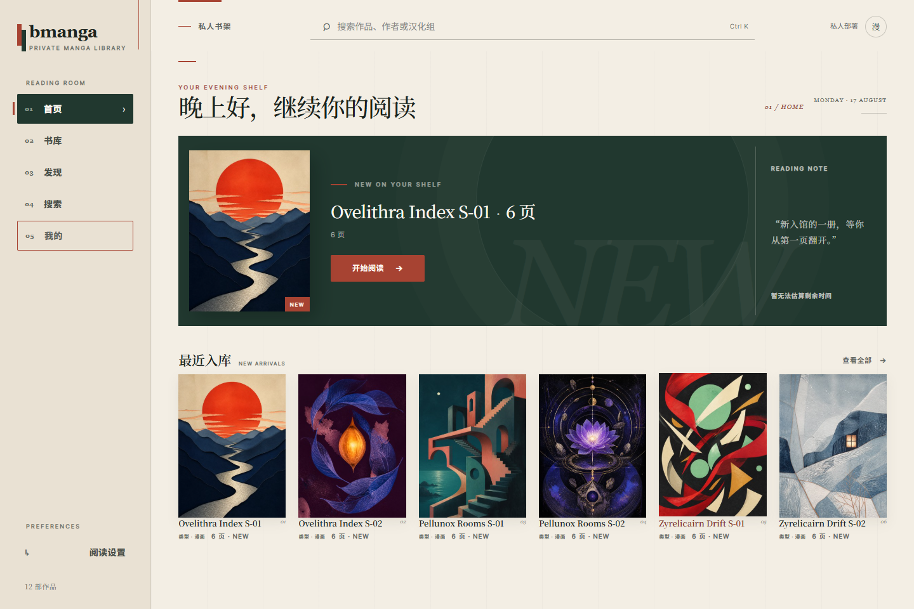
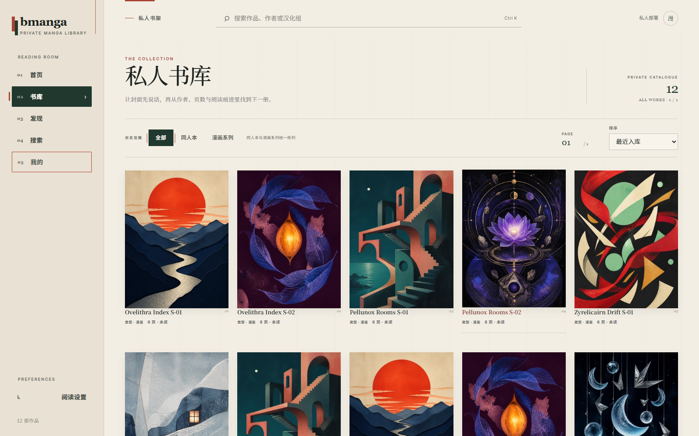

# bmanga-core

[English](README.md) · **简体中文** · [日本語](README.ja.md)

**把你有权使用的本地漫画或图像归档目录，变成一个本地优先、自托管的网页书库，提供可搜索书架、
阅读器和阅读进度。随附 Compose 配置以只读方式挂载源漫画目录。**

[5 分钟体验](#5-分钟体验ghcr) ·
[报告问题][bug-report] · [参与讨论][discussions]

[](https://github.com/zzzcws/bmanga-core/releases/tag/v0.1.0-alpha.4)
[](https://github.com/zzzcws/bmanga-core/actions/workflows/ci.yml)
[](https://github.com/zzzcws/bmanga-core/pkgs/container/bmanga-core)
[](LICENSE)

> [!WARNING]
> bmanga-core 目前是 **alpha 预览版**。已发布容器目前仅支持
> **Linux/amd64**，请勿将服务直接暴露到公网。

> [!NOTE]
> 当前发布的 `v0.1.0-alpha.4` 镜像提供 English / 简体中文 / 日本語 界面选择。
> 该选择只切换界面文字，不会自动翻译书籍内容或书库元数据；在用户明确选择前，
> 简体中文仍是安全默认语言。



**更多合成演示截图：**




_截图中的元数据和封面均为合成演示内容；bmanga-core 不附带可导入书籍、独立封面或示例归档。
截图展示简体中文界面，可在“设置”中切换语言。_

## 公开核心能做什么

- 将有权使用的本地图像目录和支持的图像归档索引到本地 SQLite 目录中。
- 提供网页书架、目录搜索、作品详情、图像阅读器和本地阅读进度。
- Compose 配置将源漫画目录以只读方式挂载；展示用元数据覆盖不会重命名或改写源文件。
- 不需要内容平台账号，也不包含在线内容源集成；核心目录和阅读流程不依赖非必要外部服务。
- 提供有限的运行诊断，以及一个用于比较待整理目录与书库目录的源码级只读导入计划工具。

### 当前支持边界

| 输入 | Alpha 公开核心 |
| --- | --- |
| 图像文件夹 | 支持 |
| ZIP/CBZ 图像归档 | 支持 |
| 单层嵌套 ZIP 图像归档 | 支持 |
| 基于图像的 EPUB | 通过 Go 原生 ZIP 阅读路径支持 |
| PDF，包括 ZIP 内嵌 PDF | 不包含 |
| 7z | 不包含 |
| MOBI 转换 | 不包含 |
| 在线内容源、下载或同步适配器 | 不存在 |

不支持的格式会被明确拒绝或跳过，不会静默调用私有辅助程序。完整边界请参阅
[`docs/architecture/public-core-boundary.md`](docs/architecture/public-core-boundary.md)。

## 5 分钟体验（GHCR）

你需要安装 Docker 与 Compose，使用 Linux/amd64 主机（或兼容的 amd64 Linux
虚拟机），并准备一个只包含你有权阅读内容的目录。

```sh
git clone https://github.com/zzzcws/bmanga-core.git
cd bmanga-core
cp config/compose.env.example .env
cp config/libraries.example.json config/libraries.json
```

编辑未跟踪的 `.env`，至少设置以下项目：

```dotenv
BMANGA_IMAGE=ghcr.io/zzzcws/bmanga-core:0.1.0-alpha.4
BMANGA_AUTH_USER=bmanga
BMANGA_AUTH_PASSWORD=<足够长的随机密码>
BMANGA_SESSION_SECRET=<另一个足够长的随机值>
BMANGA_LIBRARY_PATH=/你的/授权漫画目录/绝对路径
```

拉取固定 alpha 版本，显式扫描一次，然后启动服务：

```sh
docker compose --env-file .env --profile tools pull
docker compose --env-file .env --profile tools run --rm scan
docker compose --env-file .env up -d bmanga
```

打开 <http://127.0.0.1:8765>，使用 `.env` 中的账号密码登录。首次扫描把目录数据写入
`bmanga-data` 数据卷，不会写入只读挂载的源漫画目录。停止服务：

```sh
docker compose --env-file .env down
```

Alpha 阶段不会发布 `latest` 标签。更新固定版本前，请先阅读
[发布说明](https://github.com/zzzcws/bmanga-core/releases/tag/v0.1.0-alpha.4)。

## 邀请早期测试者

我们希望得到已有本地漫画或图像归档、并对这些内容拥有使用权的用户的真实反馈。第一次测试可以很简单：

1. 记录在 Linux/amd64 上完成安装和首次扫描所需的时间。
2. 尝试一种或多种已支持格式。
3. 在桌面或手机上检查书架导航、阅读进度和阅读器行为。
4. 告诉我们哪里难懂、缓慢或出错。

你可以[报告问题][bug-report]、[提出功能建议][feature-request]，或
[发起讨论][discussions]。请勿上传受版权保护的媒体、账号凭据、
私人主机名、漫画库绝对路径或未经脱敏的日志。安全问题请使用
[`SECURITY.md`](SECURITY.md) 中的私密渠道。

## 从干净检出构建

源码构建需要 Go 1.26.6 或更高版本，以及 Node.js 24 或更高版本。CI 和容器构建目前固定使用
已审查的 Node.js 24.19.0 工具链。

```sh
node tools/build-web-assets.mjs --ci
go test ./...
go vet ./...
mkdir -p out
CGO_ENABLED=0 go build -buildvcs=false -mod=readonly -trimpath \
  -o out/bmanga ./cmd/bmanga-go
CGO_ENABLED=0 go build -buildvcs=false -mod=readonly -trimpath \
  -o out/bmanga-scan ./cmd/bmanga-scan
```

本地构建容器：

```sh
docker build -t bmanga:local .
```

前端构建使用已提交的 npm 锁文件，并将 Git 忽略的输出写入 `web/v2`。最终容器只包含两个静态
Go 二进制文件、生成的网页资源和已审查的许可材料，不包含 Python、Node.js/npm 运行时或
文档/归档辅助包。

## 仅限本地的工作流

- **展示元数据覆盖**：将标题、作者、系列标签和语言覆盖保存在 SQLite 中，不修改源文件。参阅
  [`docs/features/metadata-overrides.md`](docs/features/metadata-overrides.md)。
- **运行诊断**：提供有限的运行时长、数据库可用性和应用缓存汇总，不返回路径或底层错误文本。参阅
  [`docs/features/runtime-diagnostics.md`](docs/features/runtime-diagnostics.md)。
- **只读导入计划器**：对显式选择的待整理目录和书库目录进行哈希比较，并写出私有 JSON 审查计划；
  不提供应用、移动、覆盖、隔离或删除操作。它是源码工具，不包含在 alpha 容器中。参阅
  [`docs/read-only-import-planner.md`](docs/read-only-import-planner.md)。

## 仓库结构

- `cmd/bmanga-go` — 服务入口和认证边界。
- `cmd/bmanga-scan` — 显式执行、与来源无关的目录扫描器。
- `cmd/bmanga-import-plan` — 有边界的只读待整理目录/书库比较工具。
- `internal/prototype` — 目录、阅读器、审查和本地状态 API。
- `web-v2` — React/Vite 界面及测试。
- `tools/build-web-assets.mjs` — 锁定依赖的 V2 生产资源构建器。
- `Dockerfile` 和 `compose.yaml` — 可从干净检出构建的 Linux/amd64 部署配置。
- `docs/releasing.md` — 隐私、供应链和发布证据门禁。

## 安全、内容与发布边界

bmanga-core 不附带可导入书籍、独立封面、账号凭据、内容源会话或示例归档，也不用于绕过认证、DRM、访问控制
或内容平台条款。操作者必须仅使用自己有权访问的材料。

随附 Compose 配置将 HTTP 绑定到 `127.0.0.1`，以只读方式挂载源漫画目录，丢弃 Linux capabilities，
并以数字用户 `65532:65532` 运行 `scratch` 镜像。这些是部署约束，不代表我们承诺任何环境或不可信归档
都绝对安全。如需远程访问，请使用带认证的 TLS 反向代理，并设置 `BMANGA_COOKIE_SECURE=1`。

公开源码和已发布制品采用不同门禁。带标签的 alpha 镜像从不可变 commit 构建，经过检查和冒烟测试，
并随镜像 SBOM、GitHub build provenance 和无密钥签名发布。创始维护者对首批内容的发布授权记录在
[`docs/first-party-rights.md`](docs/first-party-rights.md)；第三方映射和技术审查记录位于
[`LICENSES/`](LICENSES/)。这些记录不构成法律意见。

## 项目链接

- [贡献指南](CONTRIBUTING.md)
- [安全政策](SECURITY.md)
- [支持范围](SUPPORT.md)
- [行为准则](CODE_OF_CONDUCT.md)
- [维护者与治理](MAINTAINERS.md)
- [更新记录](CHANGELOG.md)
- [Apache-2.0 项目许可证](LICENSE)
- [第三方声明](THIRD_PARTY_NOTICES.md)
- [第三方许可材料](LICENSES/README.md)

[bug-report]: https://github.com/zzzcws/bmanga-core/issues/new?template=bug_report.yml
[feature-request]: https://github.com/zzzcws/bmanga-core/issues/new?template=feature_request.yml
[discussions]: https://github.com/zzzcws/bmanga-core/discussions
